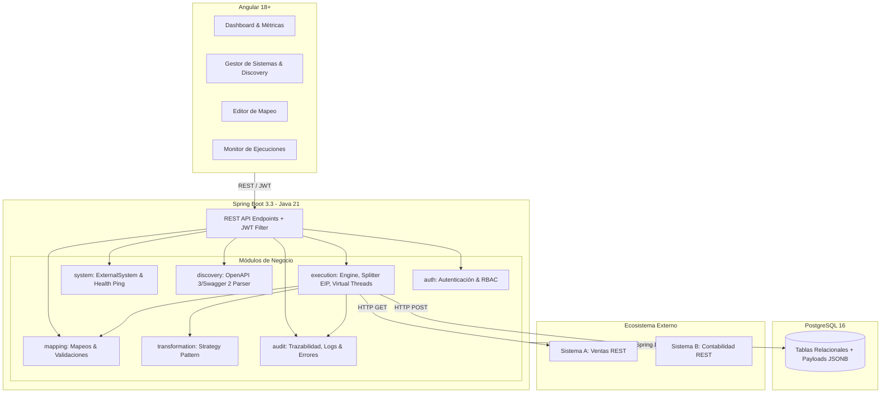

# Ficha Técnica — Integration Hub (MVP v1.0)

## 1. Información General del Proyecto
- **Nombre del Sistema:** Integration Hub
- **Versión:** 1.0.0 (MVP)
- **Tipo de Aplicación:** Plataforma Web de Integración Empresarial (iPaaS Monolítico Modular)
- **Objetivo Principal:** Conectar sistemas heterogéneos mediante descubrimiento automático de APIs (OpenAPI/Swagger), mapeo visual y transformaciones de datos, con motor de ejecución resiliente y auditoría por registro.

---

## 2. Stack Tecnológico

### Backend
- **Lenguaje:** Java 21 (LTS) — Uso de Virtual Threads para procesamiento concurrente de payloads I/O intensivos.
- **Framework Principal:** Spring Boot 3.3.x
- **Persistencia y ORM:** Spring Data JPA / Hibernate 6.x
- **Seguridad:** Spring Security 6.x + JWT (JSON Web Tokens) con jjwt 0.12.x
- **Validación:** Jakarta Bean Validation (Hibernate Validator)
- **Documentación de APIs:** Springdoc-OpenAPI 2.x (OpenAPI 3.0 / Swagger UI)
- **Parser OpenAPI Externo:** `io.swagger.parser.v3:swagger-parser` para descubrimiento de APIs de terceros y resolución de referencias `$ref`.
- **Procesamiento JSON y Rutas:** Jackson Databind + Jayway JsonPath para extracción de campos anidados.
- **Cliente HTTP:** Spring WebClient / JDK 21 HttpClient para invocaciones externas con timeouts configurables.
- **Testing:** JUnit 5, Mockito, Testcontainers (PostgreSQL para pruebas de integración).
- **Gestor de Dependencias y Build:** Maven 3.9+

### Base de Datos
- **Motor:** PostgreSQL 16
- **Control de Versiones de BD:** Flyway para migraciones de esquema versionadas (`src/main/resources/db/migration`).

### Frontend
- **Framework:** Angular 18+ (Standalone Components, Signals, Reactive Forms)
- **Lenguaje:** TypeScript 5.x
- **Estilos:** Vanilla CSS / Modern Design System (modo oscuro, tokens semánticos, micro-animaciones).
- **Comunicación:** Angular HttpClient + RxJS + WebSockets/SSE (para logs de ejecución en tiempo real).

### Infraestructura y Despliegue
- **Contenedores:** Docker & Docker Compose
- **Servicios Dockerizados:**
  - `integration-hub-db`: PostgreSQL 16
  - `integration-hub-backend`: Spring Boot (Java 21)
  - `mock-sales-api`: Simulador Sistema A (GET /sales)
  - `mock-invoicing-api`: Simulador Sistema B (POST /invoices)

---

## 3. Arquitectura del Software

Se implementa una arquitectura **Monolito Modular** orientada al dominio (Domain-Driven Design / Clean Architecture), preparando el sistema para ser desacoplado en microservicios en versiones posteriores si la carga lo requiere.

---

## 4. Requisitos No Funcionales (NFR)

1. **Rendimiento y Concurrencia:**
   - Procesamiento de lotes de hasta 1,000 registros por ejecución sin degradación de memoria utilizando **Java 21 Virtual Threads** para llamadas I/O salientes hacia los sistemas de destino.
2. **Resiliencia y Aislamiento de Errores:**
   - La falla en un registro individual (ej. HTTP 400 por payload inválido) **no** debe abortar el lote completo. El sistema registrará éxito parcial (`PARTIAL_SUCCESS`) y permitirá reintentar exclusivamente los fallidos.
3. **Trazabilidad y Observabilidad:**
   - Generación de un `Correlation ID` (UUID v4) por ejecución, inyectado en el header HTTP `X-Correlation-ID` en todas las llamadas entrantes y salientes.
   - Registro forense en base de datos del request crudo, payload transformado, respuesta del destino y códigos HTTP por cada registro (`ExecutionRecord`).
4. **Seguridad:**
   - Contraseñas y secretos de clientes cifrados en reposo (AES-256 / BCrypt).
   - Acceso a la API protegido mediante Tokens JWT con expiración configurable.
   - Roles iniciales: `ADMIN` y `OPERATOR`.
5. **Idempotencia:**
   - Soporte para claves de idempotencia en reintentos de registros para evitar facturación duplicada en el sistema destino.
