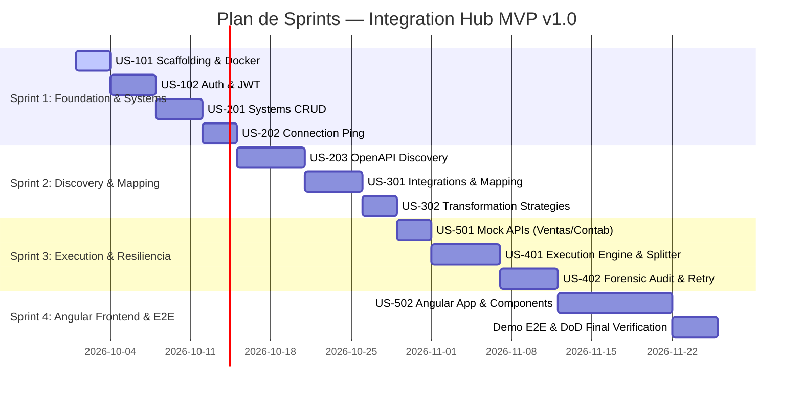

# Marco de Trabajo Ágil: Scrum — Integration Hub

Este documento detalla la aplicación de la metodología **Scrum** para el desarrollo del MVP v1.0 de Integration Hub, incluyendo roles, acuerdos de equipo (DoD / DoR), desglose de épicas, historias de usuario (US) con criterios de aceptación Gherkin y la planificación de Sprints.

---

## 1. Roles y Responsabilidades

- **Product Owner (PO):** Define la visión del producto, prioriza el Product Backlog y valida el cumplimiento del criterio de aceptación en cada Sprint Review.
- **Scrum Master (SM):** Asegura la aplicación de las buenas prácticas ágiles, remueve impedimentos técnicos y facilita ceremonias.
- **Development Team:** Diseña, implementa, prueba (TDD / BDD) y despliega los incrementos funcionales.

---

## 2. Acuerdos de Trabajo del Equipo

### Definición de Preparado (Definition of Ready - DoR)
Una Historia de Usuario está lista para entrar a un Sprint si:
1. Sigue el formato estándar: *Como [rol], quiero [acción], para [beneficio]*.
2. Cumple con los principios **INVEST** (Independiente, Negociable, Valiosa, Estimable, Pequeña, Comprobable).
3. Tiene criterios de aceptación explícitos en formato **Given-When-Then (Gherkin)**.
4. Las dependencias técnicas o de APIs externas están identificadas.
5. Cuenta con estimación en Story Points (secuencia Fibonacci: 1, 2, 3, 5, 8).

### Definición de Hecho (Definition of Done - DoD)
Un incremento funcional se considera terminado si:
1. El código compila sin advertencias y sigue la arquitectura modular definida.
2. Posee pruebas unitarias (JUnit 5 / Mockito) con cobertura mínima del 80% en lógica de negocio.
3. Se integran pruebas de integración con Testcontainers (PostgreSQL).
4. El endpoint está documentado en Swagger / OpenAPI (`/swagger-ui.html`).
5. El código pasa el análisis estático de código sin errores críticos o de seguridad.
6. La funcionalidad ha sido validada contra los criterios de aceptación Gherkin.
7. La documentación técnica en `/docs` se encuentra actualizada.

---

## 3. Product Backlog por Épicas

```
ÉPICA 1: Fundamentos y Seguridad (Foundation & Auth)
ÉPICA 2: Conectores y Descubrimiento (External Systems & Discovery)
ÉPICA 3: Mapeo y Transformación (Data Mapping & Transformations)
ÉPICA 4: Motor de Ejecución y Resiliencia (Execution Engine & Resilience)
ÉPICA 5: Interfaz de Usuario y Experiencia de Operación (Angular Dashboard & UI)
```

---

## 4. Historias de Usuario Detalladas (User Stories)

### Épica 1: Fundamentos y Seguridad

#### US-101: Scaffolding Backend y Base de Datos (3 SP)
*Como desarrollador, quiero inicializar el proyecto base Spring Boot 3 con Java 21 y PostgreSQL en Docker para tener un entorno de ejecución estandarizado.*
- **Criterios de Aceptación:**
  - **Scenario:** Despliegue de infraestructura
    - **Given** Docker Compose instalado
    - **When** ejecuto `docker-compose up -d`
    - **Then** el contenedor de PostgreSQL 16 levanta en el puerto 5432 y responde a conexiones.
  - **Scenario:** Health Check inicial
    - **Given** la aplicación Spring Boot iniciada
    - **When** realizo un `GET /api/v1/health`
    - **Then** obtengo estado `200 OK` con payload `{"status": "UP"}`.

#### US-102: Autenticación con JWT y Roles (5 SP)
*Como usuario administrador, quiero autenticarme mediante usuario y contraseña para obtener un token JWT que proteja mis peticiones.*
- **Criterios de Aceptación:**
  - **Scenario:** Login exitoso
    - **Given** un usuario administrador registrado con password cifrada
    - **When** envía `POST /api/v1/auth/login` con credenciales válidas
    - **Then** recibe código `200 OK` con un token JWT firmado y tiempo de expiración.
  - **Scenario:** Petición no autorizada
    - **Given** una petición a un endpoint protegido sin header `Authorization`
    - **When** se procesa la petición
    - **Then** el servidor responde `401 Unauthorized`.

---

### Épica 2: Conectores y Descubrimiento

#### US-201: Registro y CRUD de Sistemas Externos (5 SP)
*Como administrador, quiero registrar y administrar sistemas externos REST para poder integrarlos más adelante.*
- **Criterios de Aceptación:**
  - **Scenario:** Registro de sistema con credenciales
    - **Given** nombre, URL base y tipo de auth (`Bearer Token`)
    - **When** se invoca `POST /api/v1/systems`
    - **Then** el sistema se guarda con estado `ACTIVE` y el token queda encriptado en la base de datos.

#### US-202: Prueba de Conexión (Ping) (3 SP)
*Como administrador, quiero probar la conexión con un sistema externo para saber de inmediato si su URL responde antes de configurarlo.*
- **Criterios de Aceptación:**
  - **Scenario:** Ping exitoso
    - **Given** un sistema externo cuya URL responde
    - **When** ejecuto `POST /api/v1/systems/{id}/ping`
    - **Then** obtengo `status: UP` y la latencia en milisegundos (`latencyMs: 120`).

#### US-203: Descubrimiento Automático OpenAPI (8 SP)
*Como administrador, quiero que el Hub inspeccione la URL del sistema y extraiga sus endpoints y esquemas automáticamente.*
- **Criterios de Aceptación:**
  - **Scenario:** Detección de endpoints OpenAPI v3
    - **Given** un sistema cuya URL expone `/v3/api-docs`
    - **When** se solicita `POST /api/v1/systems/{id}/discover`
    - **Then** el motor resuelve los esquemas `$ref` y almacena los endpoints (verbo, path, request/response schema).

---

### Épica 3: Mapeo y Transformación

#### US-301: Creación de Integraciones y Reglas de Mapeo (5 SP)
*Como administrador, quiero definir una integración seleccionando endpoint origen y destino, vinculando sus campos.*
- **Criterios de Aceptación:**
  - **Scenario:** Configuración de mapeo campo a campo
    - **Given** un endpoint origen `GET /sales` y destino `POST /invoices`
    - **When** mapeo `id` -> `reference` y `customerName` -> `customer`
    - **Then** la integración se almacena con sus reglas de mapeo en estado `ACTIVE`.

#### US-302: Motor de Estrategias de Transformación (5 SP)
*Como desarrollador, quiero aplicar transformaciones (TRIM, UPPERCASE, NUMBER, DATE_FORMAT) mediante el patrón Strategy.*
- **Criterios de Aceptación:**
  - **Scenario:** Transformación numérica
    - **Given** un valor origen `"150.50"` con estrategia `NUMBER`
    - **When** se aplica la transformación
    - **Then** el resultado es el valor numérico `150.50`.

---

### Épica 4: Motor de Ejecución y Resiliencia

#### US-401: Motor de Ejecución con Splitter EIP y Virtual Threads (8 SP)
*Como operador, quiero disparar la ejecución de una integración para que el Hub consulte el origen, transforme los datos y los envíe al destino.*
- **Criterios de Aceptación:**
  - **Scenario:** Ejecución con array de 100 registros
    - **Given** el origen retorna una lista de 100 ventas
    - **When** se ejecuta `POST /api/v1/integrations/{id}/execute`
    - **Then** se generan 100 `ExecutionRecord`, se envían al destino en paralelo con Virtual Threads y se asigna un `Correlation ID`.

#### US-402: Trazabilidad Forense y Reintento de Fallidos (5 SP)
*Como operador, quiero ver qué registros fallaron y reintentar únicamente esos registros sin reenviar los exitosos.*
- **Criterios de Aceptación:**
  - **Scenario:** Reintento quirúrgico
    - **Given** una ejecución con 97 éxitos y 3 fallos (HTTP 400)
    - **When** se ejecuta `POST /api/v1/executions/{id}/retry-failed`
    - **Then** el motor únicamente reenvía los 3 registros fallidos y actualiza sus estados individuales.

---

### Épica 5: Frontend Angular y Mock APIs

#### US-501: Mock APIs para Pruebas E2E (3 SP)
*Como desarrollador, quiero disponer de simuladores locales de Ventas y Facturación para validar el flujo completo sin dependencias externas.*

#### US-502: Dashboard y Monitor de Integraciones en Angular (8 SP)
*Como usuario, quiero una interfaz web moderna para gestionar sistemas, ver mappings visuales y monitorear ejecuciones en tiempo real.*

---

## 5. Planificación de Sprints (Roadmap del MVP)



- **Sprint 1 (Velocidad estimada: 16 SP):** Cimientos de arquitectura, Docker, PostgreSQL, seguridad JWT y módulo `system` con Ping.
- **Sprint 2 (Velocidad estimada: 18 SP):** Motor de descubrimiento OpenAPI (`swagger-parser`) y motor de mapeos y transformaciones con Strategy Pattern.
- **Sprint 3 (Velocidad estimada: 16 SP):** Mock APIs de prueba, motor de orquestación (Splitter, Virtual Threads, Correlation ID) y auditoría con reintentos.
- **Sprint 4 (Velocidad estimada: 12 SP):** Interfaz gráfica en Angular, conexión completa E2E y validación del criterio de aceptación final (100 registros con 3 fallos y reintento).
